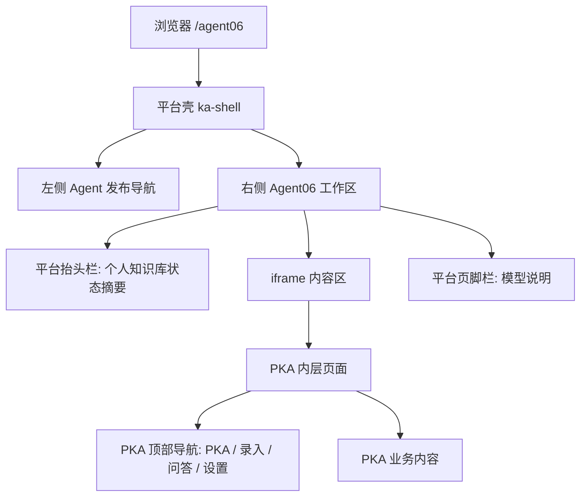

# 个人知识库当前页面排布

## 1. 总体结构

当前 `http://127.0.0.1:3000/agent06` 是两层页面：

1. 外层：web 平台壳，由 `/Users/tristanzh/agent/web/server.mjs` 渲染。
2. 内层：PKA 页面，通过 iframe 加载 `/agent06/`、`/agent06/ask`、`/agent06/settings`。



## 2. 外层平台壳排布

### 2.1 页面骨架

```text
┌──────────────────────────────────────────────────────────────────────┐
│ 平台页面 /agent06                                                     │
├───────────────┬──────────────────────────────────────────────────────┤
│               │ ┌──────────────────────────────────────────────────┐ │
│ 左侧发布导航   │ │ 平台抬头栏                                         │ │
│ Agent发布中心 │ │ 个人知识库                                         │ │
│ Agent01-06    │ │ 175 个知识片段 · 7 份资料 · 最近更新 未知             │ │
│               │ │ DeepSeek 已连接 · 本地向量库已启用                   │ │
│               │ └──────────────────────────────────────────────────┘ │
│               │ ┌──────────────────────────────────────────────────┐ │
│               │ │ iframe: PKA 页面                                  │ │
│               │ │                                                  │ │
│               │ │                                                  │ │
│               │ │                                                  │ │
│               │ └──────────────────────────────────────────────────┘ │
│               │ ┌──────────────────────────────────────────────────┐ │
│               │ │ 页脚栏: DeepSeek / codex-base / bge-m3 说明        │ │
│               │ └──────────────────────────────────────────────────┘ │
└───────────────┴──────────────────────────────────────────────────────┘
```

### 2.2 外层 CSS 结构

来源：`/Users/tristanzh/agent/web/app/agent06.css`

```text
.agent06-reference-cockpit
  display: grid
  grid-template-rows:
    auto                -> 平台抬头栏
    minmax(720px, 1fr)  -> iframe 内容区
    auto                -> 平台页脚栏
  gap: 12px
  padding: 12px
```

### 2.3 当前空间占用

| 区块 | 当前作用 | 用户价值 | 空间问题 |
|---|---|---:|---|
| 左侧 Agent 发布导航 | 切换 Agent01-06 | 中 | 固定占据左侧宽度 |
| 平台抬头栏 | 展示知识库状态 | 中 | 只用左侧文本，右侧大面积空白 |
| iframe 内容区 | 承载 PKA 实际工作流 | 高 | 被外层抬头、页脚、内层导航共同压缩 |
| 平台页脚栏 | 展示模型说明 | 低 | 与抬头状态重复，继续占据垂直空间 |

## 3. 平台抬头栏当前排布

### 3.1 当前内容

```text
个人知识库
175 个知识片段 · 7 份资料 · 最近更新 未知
DeepSeek 已连接 · 本地向量库已启用
```

### 3.2 当前视觉结构

```text
┌──────────────────────────────────────────────────────────────────────┐
│ 个人知识库                                                            │
│ 175 个知识片段 · 7 份资料 · 最近更新 未知                              │
│ ● DeepSeek 已连接   ● 本地向量库已启用                                 │
│                                                                      │
│                                                                      │
│                                           右侧没有内容，形成空白浪费      │
└──────────────────────────────────────────────────────────────────────┘
```

### 3.3 当前问题

- 抬头栏是整行卡片，但内容只集中在左侧。
- 状态信息只有 3 行，无法支撑整块横向空间。
- 抬头栏没有承载主要操作，右侧没有搜索、录入、问答、设置入口。
- 下方 iframe 内部又有一套 `PKA / 录入 / 问答 / 设置` 导航，形成重复导航层。

## 4. iframe 内层 PKA 通用排布

三个 PKA 页面都有相同内层顶部导航：

```text
┌──────────────────────────────────────────────────────────────────────┐
│ PKA        录入        问答                                  设置       │
└──────────────────────────────────────────────────────────────────────┘
```

来源：`static/index.html`、`static/ask.html`、`static/settings.html`

```html
<nav class="topbar">
  <a class="brand" href="./">PKA</a>
  <a href="./">录入</a>
  <a href="ask">问答</a>
  <a class="topbar-settings" href="settings">设置</a>
</nav>
```

CSS：

```text
.topbar
  height: 58px
  padding: 0 28px
  gap: 18px
  position: sticky
```

### 当前问题

- 外层已经有“个人知识库”标题，内层又显示 `PKA`。
- 内层 `录入 / 问答 / 设置` 占据 58px 高度。
- 外层平台抬头也占据高度，导致实际工作区被两层头部压缩。
- 设置入口在内层右侧，平台抬头右侧却空置。

## 5. 录入页当前排布

URL：`/agent06/`

```text
iframe 内部：

┌──────────────────────────────────────────────────────────────────────┐
│ PKA        录入        问答                                  设置       │
├──────────────────────────────────────────────────────────────────────┤
│                                                                      │
│ ┌──────────────────────────────────────────────────────────────────┐ │
│ │ 内容录入                                                         │ │
│ │ ┌──────────────────────────────────────────────────────────────┐ │ │
│ │ │ textarea: 粘贴笔记、复盘、报告片段                            │ │ │
│ │ └──────────────────────────────────────────────────────────────┘ │ │
│ │ [录入文本]                                                       │ │
│ │ feedback                                                         │ │
│ └──────────────────────────────────────────────────────────────────┘ │
│                                                                      │
│ ┌──────────────────────────────────────────────────────────────────┐ │
│ │ 文件上传                                                         │ │
│ │ [选择文件] [上传并解析]                                           │ │
│ │ feedback                                                         │ │
│ └──────────────────────────────────────────────────────────────────┘ │
└──────────────────────────────────────────────────────────────────────┘
```

### 录入页 CSS

```text
.shell
  width: min(1120px, calc(100vw - 32px))
  margin: 28px auto
  display: grid
  gap: 18px

.panel
  padding: 22px
  border + shadow

textarea
  min-height: 220px

button
  min-height: 42px
```

### 当前空间特点

- 录入页业务区是纵向两张卡片。
- 顶部导航、外层抬头、外层页脚都会减少可见录入区域。
- 文本录入和文件上传逻辑已经分离，但页面总高度较高。

## 6. 问答页当前排布

URL：`/agent06/ask`

```text
iframe 内部：

┌──────────────────────────────────────────────────────────────────────┐
│ PKA        录入        问答                                  设置       │
├──────────────────────────────────────────────────────────────────────┤
│                                                                      │
│ ┌──────────────────────────────────────────────────────────────────┐ │
│ │ 知识库问答                                                       │ │
│ │ [导出 Word] [导出 PPT]  -> 初始隐藏，回答完成后显示                │ │
│ │                                                                  │ │
│ │ ┌──────────────────────────────────────────────────────────────┐ │ │
│ │ │ conversation 对话区                                           │ │ │
│ │ │ 空状态示例 / 用户消息 / 助手回答 / 参考来源                     │ │ │
│ │ └──────────────────────────────────────────────────────────────┘ │ │
│ │                                                                  │ │
│ │ 中文建议 English Report    [问题输入框]                  [发送]    │ │
│ └──────────────────────────────────────────────────────────────────┘ │
└──────────────────────────────────────────────────────────────────────┘
```

### 问答页 CSS

```text
.ask-panel
  display: flex
  flex-direction: column
  height: calc(100vh - 160px)

.conversation
  flex: 1
  max-height: calc(100vh - 320px)
  overflow-y: auto

.querybar
  display: flex
  align-items: center
  gap: 10px
  margin-top: 12px

.language-switch
  display: flex
  gap: 12px
```

### 当前空间特点

- 问答页为了保证输入框首屏可见，内部用了固定高度计算。
- 语言切换、输入框、发送按钮在同一行。
- 导出按钮延迟显示，减少初始干扰。
- 但内层顶部导航仍占据 58px。

## 7. 设置页当前排布

URL：`/agent06/settings`

```text
iframe 内部：

┌──────────────────────────────────────────────────────────────────────┐
│ PKA        录入        问答                                  设置       │
├──────────────────────────────────────────────────────────────────────┤
│                                                                      │
│ ┌──────────────────────────────────────────────────────────────────┐ │
│ │ 模型配置                                                         │ │
│ │ DeepSeek Endpoint        DeepSeek API Key                         │ │
│ │ DeepSeek 模型名称        英文输出 Endpoint                         │ │
│ │ 英文输出 API Key         英文输出模型名称                           │ │
│ │ OCR Endpoint             OCR API Key                               │ │
│ │ Embedding 模型           检索结果数量                               │ │
│ │ [保存] [测试连接]                                                 │ │
│ │ feedback                                                         │ │
│ └──────────────────────────────────────────────────────────────────┘ │
│                                                                      │
│ ┌──────────────────────────────────────────────────────────────────┐ │
│ │ 危险操作                                                         │ │
│ │ 清空知识库中所有已索引的内容。此操作不可撤销。                     │ │
│ │ [清空知识库]                                                     │ │
│ └──────────────────────────────────────────────────────────────────┘ │
└──────────────────────────────────────────────────────────────────────┘
```

### 设置页 CSS

```text
.settings-grid
  grid-template-columns: repeat(2, minmax(0, 1fr))

.actions
  grid-column: 1 / -1
  display: flex
  gap: 10px

@media max-width 720px
  .settings-grid -> 1 column
```

## 8. 当前页面层级中的重复区域

```text
外层平台：
  左侧 Agent 导航
  平台抬头栏：个人知识库 + 状态
  iframe 内容区
  平台页脚栏：模型说明

内层 PKA：
  顶部导航：PKA / 录入 / 问答 / 设置
  业务内容卡片
```

### 重复点

| 重复内容 | 外层位置 | 内层位置 | 问题 |
|---|---|---|---|
| 产品名 | 平台抬头 `个人知识库` | 内层 topbar `PKA` | 名称重复 |
| 导航入口 | 平台左侧 Agent 导航 | 内层 `录入/问答/设置` | 导航层级过多 |
| 模型状态 | 平台抬头 `DeepSeek/bge-m3` | 平台页脚模型说明 | 信息重复 |
| 设置入口 | 内层 topbar 右侧 | 外层抬头右侧空白 | 操作入口没有利用外层空间 |

## 9. 当前空间浪费点

### 9.1 横向浪费

```text
平台抬头栏：

┌──────────────────────────────────────────────────────────────────────┐
│ 左侧 30%-40%：标题 + 状态                                             │
│ 右侧 60%-70%：空白                                                    │
└──────────────────────────────────────────────────────────────────────┘
```

### 9.2 纵向浪费

```text
从上到下：

平台抬头栏
  + 12px gap
iframe 边框和 padding
  + PKA 内层 topbar 58px
  + shell margin-top 28px
  + 页面卡片标题区
```

实际用户要操作的输入框、上传按钮、问答输入框被这些层级向下推。

## 10. 当前排布总结

当前页面不是一个单层工作台，而是：

```text
平台工作台
  嵌套
    PKA 工作台
```

这导致：

- 外层抬头右侧空间闲置。
- 内层导航继续占据高度。
- 录入、问答、设置入口没有合并到一个统一操作区。
- iframe 让 PKA 页面像一个独立网站嵌在平台里，而不是平台原生工具。
- 用户视觉上要先越过平台导航、平台抬头、内层导航，才能进入真正工作区。

## 11. 可作为后续改版的方向

这里只记录方向，不代表已实现：

```text
建议把外层抬头栏改成真正的工作台控制条：

┌──────────────────────────────────────────────────────────────────────┐
│ 个人知识库       175片段 · 7资料 · DeepSeek · 向量库       [录入] [问答] [设置] │
└──────────────────────────────────────────────────────────────────────┘

iframe 内层：
  删除或隐藏 PKA topbar
  直接显示当前业务页面内容
```

这样可以把“产品名、状态、页面切换、设置入口”集中到一个区域，释放 iframe 内部 58px 顶部导航空间。
