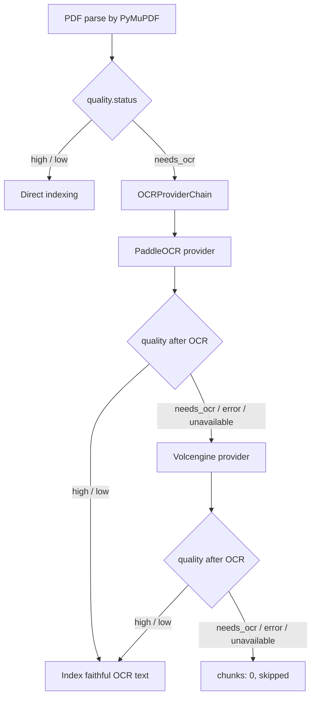

# PKA OCR Provider Abstraction — SDD/TDD

## 1. 背景与目标

当前 PKA 已经具备 PDF 质量门禁: 文本层不可用的 PDF 会被判定为 `needs_ocr`，在 OCR 不可用或 OCR 失败时 `chunks: 0`，不写入 ChromaDB 和 FTS5。现有实现只有单一 `VolcengineOCR` 客户端，配置为空时无法处理扫描版 PDF。

本轮目标是把 OCR 从单一云端客户端升级为可插拔 provider chain:



核心原则:

- OCR 是 faithful transcription，只做原文转写，不摘要、不改写、不翻译、不补全。
- 只有 `needs_ocr` 触发 OCR，`low` 不触发 OCR。
- 每个 OCR provider 产物都必须重新走 `clean_pdf_text()` 和 `assess_pdf_quality()`。
- 任一 provider 失败、不可用、或转写后仍为 `needs_ocr`，继续尝试下一个 provider。
- 全链路失败时 `chunks: 0`，不写入 ChromaDB，不写入 FTS5，只保留 raw 文件和质量状态。

## 2. 非目标

- 不把 Qwen2.5-VL 或任何视觉理解模型接入主 chunk/embedding 链路。
- 不对 `low` PDF 触发 OCR 重提取。
- 不在本轮自动安装 PaddleOCR 依赖。
- 不自动清理已有脏数据。历史数据仍需 `POST /api/ingest/clear` 后重新上传，或未来单独实现 reindex。
- 不把 OCR provider chain 称为跨库事务。索引写入仍是补偿式一致性。

## 3. 接口设计

### 3.1 OCR provider protocol

新增统一协议，所有 provider 只暴露 PDF 级 OCR 方法。

```python
class OCRProvider:
    name: str

    def available(self) -> bool:
        raise NotImplementedError

    async def extract_pdf(self, pdf_path: str, max_pages: int = 50) -> str:
        raise NotImplementedError
```

接口约束:

- `extract_pdf()` 是唯一供 PDF fallback 调用的方法。
- 不允许服务层对 PDF 调用 `extract([pdf_path])`。
- 返回值必须是逐页逐行的原文转写文本。
- 不可用时 `available()` 返回 `False`，不抛出启动级异常。
- 运行失败时可抛出异常，由 chain 记录并尝试下一个 provider。

### 3.2 Provider chain

新增 `OCRProviderChain`，服务层只依赖 chain。

```python
@dataclass(frozen=True)
class OCRAttempt:
    provider: str
    status: str       # "unavailable" | "failed" | "needs_ocr" | "accepted"
    error: str = ""
    quality: ParseQuality | None = None


@dataclass(frozen=True)
class OCRChainResult:
    text: str
    quality: ParseQuality
    provider: str
    attempts: list[OCRAttempt]
```

接口方法:

```python
class OCRProviderChain:
    def __init__(self, providers: list[OCRProvider]):
        self.providers = providers

    async def extract_pdf_until_usable(
        self,
        pdf_path: str,
        *,
        page_count: int,
        max_pages: int,
    ) -> OCRChainResult | None:
        raise NotImplementedError
```

chain 负责:

1. 按配置顺序遍历 provider。
2. 跳过 `available() == False` 的 provider，并记录 attempt。
3. 调用 `provider.extract_pdf(pdf_path, max_pages=max_pages)`。
4. 对返回文本执行 `clean_pdf_text(ocr_text)`。
5. 对清洗后文本执行 `assess_pdf_quality()`。
6. 如果结果不是 `needs_ocr`，返回 `OCRChainResult`。
7. 如果结果仍是 `needs_ocr`，记录 attempt 并继续下一个 provider。
8. 所有 provider 都失败或不可用时返回 `None`。

### 3.3 PaddleOCR provider

新增 `PaddleOCRProvider`。

职责:

- 在 provider 内部 `try import paddleocr`。
- 未安装 PaddleOCR 时 `available() == False`，服务启动和上传请求都不崩溃。
- 对 PDF 逐页渲染为图片后调用 PaddleOCR。
- 按页顺序拼接 OCR 结果。
- 保留数字、小数点、百分号、单位、公司名、标题。

初始化行为:

```python
class PaddleOCRProvider:
    name = "paddle"

    def __init__(self, lang: str = "ch", use_angle_cls: bool = True, dpi: int = 150):
        self.lang = lang
        self.use_angle_cls = use_angle_cls
        self.dpi = dpi
        self._ocr = None
        self._import_error = None

    def available(self) -> bool:
        raise NotImplementedError

    async def extract_pdf(self, pdf_path: str, max_pages: int = 50) -> str:
        raise NotImplementedError
```

实现约束:

- 首次调用时懒加载 PaddleOCR，避免启动时下载或初始化模型阻塞服务。
- 临时图片目录必须在 finally 中清理。
- 结果为空字符串时视为失败结果，由 chain 继续下一个 provider。

### 3.4 Volcengine provider

保留现有 `VolcengineOCR.extract_pdf()` 能力，但纳入统一 provider 接口。

职责:

- 使用当前 `PDF_OCR_PROMPT`，且 prompt 必须明确 faithful transcription。
- 继续逐页渲染 PDF 后发送图片给云端 OCR。
- endpoint 或 api_key 缺失时 `available() == False`。

现有 `extract(image_paths, prompt)` 可继续保留给图片上传场景，但 PDF fallback 只能调用 `extract_pdf()`。

### 3.5 服务层契约

`server.py` 的 `_ingest_upload_file()` 只处理业务状态，不关心具体 provider。

伪代码:

```python
quality = parsed.quality

if quality and quality.status == "needs_ocr":
    result = await ocr_chain.extract_pdf_until_usable(
        str(output_path),
        page_count=int(parsed.metadata.get("page_count") or 1),
        max_pages=int(runtime.config["ocr"].get("max_pdf_pages", 50)),
    )
    if result is None:
        return skipped_result(action="ocr_failed_skipped", chunks=0)

    parsed = replace(
        parsed,
        text=result.text,
        quality=replace(result.quality, action="ocr"),
    )
```

状态要求:

- `needs_ocr` + provider accepted: `status: "ok"`, `chunks > 0`, `quality.action == "ocr"`。
- `needs_ocr` + provider unavailable/fail/still needs OCR: `status: "skipped"`, `chunks == 0`, `quality.action == "ocr_failed_skipped"` 或 `needs_ocr_skipped`。
- `low`: 不调用 provider chain，直接按低质量文本入库。

### 3.6 Response metadata

上传响应中的 `quality` 扩展为:

```json
{
  "status": "low",
  "action": "ocr",
  "provider": "paddle",
  "attempts": [
    {"provider": "paddle", "status": "accepted"}
  ],
  "reasons": ["OCR 后文本可用，但有效文本密度偏低"]
}
```

失败示例:

```json
{
  "status": "needs_ocr",
  "action": "ocr_failed_skipped",
  "provider": "",
  "attempts": [
    {"provider": "paddle", "status": "unavailable"},
    {"provider": "volcengine", "status": "unavailable"}
  ],
  "reasons": ["文本层为空或有效正文不足，所有 OCR provider 均不可用，未写入知识库"]
}
```

本轮前端继续只展示现有 `已 OCR / 需 OCR 未入库`。provider 名称属于调试元数据，不进入本轮 UI 交付范围。

## 4. 配置设计

### 4.1 新配置结构

```yaml
ocr:
  provider_order:
    - paddle
    - volcengine
  max_pdf_pages: 50
  paddle:
    enabled: true
    lang: ch
    use_angle_cls: true
    dpi: 150
  volcengine:
    enabled: true
    endpoint: ''
    api_key: ''
    model: doubao-1-5-vision-pro-32k
    max_images_per_request: 10
```

默认顺序必须是 `["paddle", "volcengine"]`。

### 4.2 旧配置兼容

现有 `config.yaml` 使用:

```yaml
ocr:
  endpoint: ''
  api_key: ''
  model: doubao-1-5-vision-pro-32k
  max_images_per_request: 10
```

兼容规则:

- 如果 `ocr.volcengine.endpoint` 缺失，读取 `ocr.endpoint`。
- 如果 `ocr.volcengine.api_key` 缺失，读取 `ocr.api_key`。
- 如果 `ocr.volcengine.model` 缺失，读取 `ocr.model`。
- 如果 `ocr.provider_order` 缺失，使用默认 `["paddle", "volcengine"]`。
- `sanitize_config()` 必须同时 mask `ocr.api_key` 和 `ocr.volcengine.api_key`。

## 5. TDD 用例设计

### 5.1 `tests/test_ocr_providers.py`

#### `test_paddle_provider_unavailable_when_package_missing`

模拟 `paddleocr` import 失败。

断言:

- 构造 `PaddleOCRProvider` 不抛异常。
- `available()` 返回 `False`。
- 不触发服务启动失败。

#### `test_provider_chain_tries_paddle_before_volcengine`

构造两个 fake provider:

- `paddle` 返回高质量 OCR 文本。
- `volcengine` 记录是否被调用。

断言:

- chain 返回 provider `paddle`。
- `volcengine.extract_pdf()` 未被调用。

#### `test_provider_chain_falls_back_when_paddle_fails`

构造两个 fake provider:

- `paddle.extract_pdf()` 抛 `RuntimeError("paddle failed")`。
- `volcengine.extract_pdf()` 返回高质量 OCR 文本。

断言:

- chain 返回 provider `volcengine`。
- attempts 包含 paddle failed。
- 返回 quality 不为 `needs_ocr`。

#### `test_provider_chain_falls_back_when_paddle_result_still_needs_ocr`

构造两个 fake provider:

- `paddle` 返回 `"Page 1\nPage 2"`。
- `volcengine` 返回有效正文。

断言:

- paddle attempt 状态为 `needs_ocr`。
- chain 返回 provider `volcengine`。

#### `test_provider_chain_returns_none_when_all_providers_unusable`

构造两个 fake provider:

- 一个 unavailable。
- 一个返回仍为 `needs_ocr` 的文本。

断言:

- chain 返回 `None`。
- 不产生可索引 text。

### 5.2 `tests/test_ingest_quality.py`

#### `test_low_quality_pdf_does_not_trigger_ocr_chain`

mock `parse_file()` 返回 `quality.status == "low"`。

断言:

- `_ingest_upload_file()` 不调用 `ocr_chain.extract_pdf_until_usable()`。
- 正常 chunk + index。

#### `test_needs_ocr_uses_first_successful_provider_and_indexes`

mock `parse_file()` 返回 `needs_ocr`。

mock provider chain 返回:

- `text`: 有效 OCR 原文。
- `quality.status`: `high` 或 `low`。
- `provider`: `paddle`。

断言:

- response `status == "ok"`。
- response `chunks > 0`。
- response `quality.action == "ocr"`。
- response `quality.provider == "paddle"`。

#### `test_needs_ocr_all_providers_fail_skips_without_indexing`

mock `parse_file()` 返回 `needs_ocr`。

mock provider chain 返回 `None`。

断言:

- response `status == "skipped"`。
- response `chunks == 0`。
- `runtime.indexer.upsert()` 未被调用。
- response `quality.action == "ocr_failed_skipped"`。

#### `test_needs_ocr_with_no_available_provider_returns_chunks_zero`

配置 Paddle 未安装、Volcengine endpoint/api_key 为空。

断言:

- 上传不会抛服务错误。
- 返回 `chunks == 0`。
- 不写 ChromaDB。
- 不写 FTS5。

### 5.3 `tests/test_config.py`

#### `test_ocr_default_provider_order_is_local_first`

断言:

- `DEFAULT_CONFIG["ocr"]["provider_order"] == ["paddle", "volcengine"]`。
- `paddle.enabled == True`。
- `volcengine.enabled == True`。

#### `test_legacy_volcengine_ocr_config_is_still_supported`

给 `load_config()` 一个旧格式 `ocr.endpoint/api_key/model`。

断言:

- `_build_ocr_client()` 或配置规范化逻辑能生成 Volcengine provider。
- provider 读到旧 endpoint/api_key/model。

#### `test_sanitize_config_masks_nested_volcengine_key`

断言:

- `ocr.api_key` 被 mask。
- `ocr.volcengine.api_key` 被 mask。

### 5.4 前端测试范围

本轮不改变前端 provider 展示，不新增 `tests/test_project_files.py` 用例。

必须保持:

- `qualityBadge()` 继续识别 `action == "ocr"`。
- provider 字段缺失时仍显示 `已 OCR`。
- provider/attempts 作为响应元数据存在时，不影响现有上传结果列表渲染。

## 6. 实施批次

### Batch 1: 配置与接口

改动:

- `engine/config.py`
- `engine/ocr.py`
- `tests/test_config.py`
- `tests/test_ocr_providers.py`

交付:

- 新增 provider protocol。
- 新增 `OCRProviderChain`。
- 新增默认配置和旧配置兼容。
- PaddleOCR 未安装时测试通过。

### Batch 2: Volcengine 纳入 provider chain

改动:

- `engine/ocr.py`
- `server.py`
- `tests/test_ingest_quality.py`

交付:

- 现有云端 OCR 行为不回退。
- PDF fallback 只能通过 `extract_pdf()`。
- 单一 Volcengine 配置仍可工作。

### Batch 3: PaddleOCR provider

改动:

- `engine/ocr.py`
- `tests/test_ocr_providers.py`

交付:

- PaddleOCR provider 本地优先。
- 未安装时服务不崩溃。
- 安装后可对 PDF 逐页渲染并转写。

### Batch 4: 服务层质量复检与响应元数据

改动:

- `server.py`
- `tests/test_ingest_quality.py`
- `static/app.js` 不改，除非现有渲染无法兼容新增 provider/attempts 字段。

交付:

- 每个 provider 结果都重跑质量评估。
- provider 失败或仍为 `needs_ocr` 时尝试下一个。
- 全链路失败时 `chunks: 0`。
- 响应中包含 provider/attempts 调试信息。

## 7. 验收标准

1. 高质量文本层 PDF 不触发 OCR，正常入库。
2. 低质量但有正文 PDF 不触发 OCR，清洗后入库并标记 `low`。
3. 扫描版 PDF + PaddleOCR 可用时，优先使用 PaddleOCR，OCR 后可用则入库。
4. 扫描版 PDF + PaddleOCR 失败且 Volcengine 可用时，使用 Volcengine fallback，OCR 后可用则入库。
5. 扫描版 PDF + 所有 provider 不可用或失败时，返回 `chunks: 0`，不写 ChromaDB，不写 FTS5。
6. 任一 provider 返回的文本仍为 `needs_ocr` 时，不能入库，必须继续尝试后续 provider。
7. PaddleOCR 未安装时，服务启动、上传、设置页读取都不崩溃。
8. 旧版 `ocr.endpoint/api_key/model` 配置继续可用。
9. `quality.provider` 和 `quality.attempts` 可用于定位 OCR provider 链路结果。
10. Qwen2.5-VL 或其他视觉理解输出不得进入 ChromaDB 主 collection 或 FTS5 主表。

## 8. 风险与控制

| 风险 | 控制 |
|---|---|
| PaddleOCR 首次加载慢 | 懒加载，只在 `needs_ocr` PDF 上传时初始化 |
| PaddleOCR 未安装导致 import error | provider 内部 `try import`，`available() == False` |
| OCR 抽取结果仍是页码或水印 | 每个 provider 后重跑质量评估 |
| 云端 OCR 成本失控 | `max_pdf_pages` 限制，且仅 `needs_ocr` 触发 |
| 旧配置失效 | 保留旧字段读取兼容 |
| OCR 文本污染主索引 | 只有通过质量门禁的 faithful transcription 才能 chunk/index |
