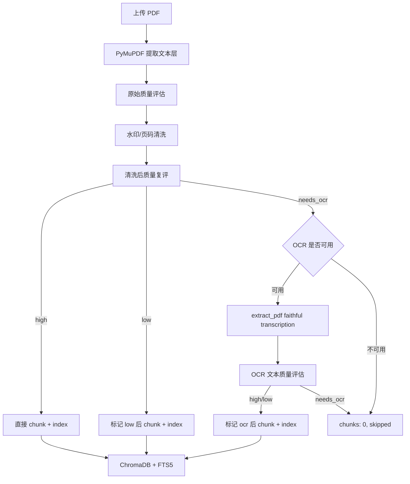
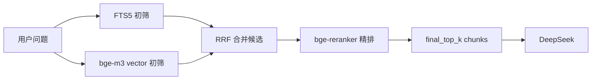

# PKA 可信入库架构 — SDD/TDD 设计 v3

> 日期: 2026-06-13  
> 目标: 将 PKA 的 PDF 处理从“文本质量优化”升级为“可信入库架构”。  
> 核心原则: 主知识库只索引 faithful source text。任何生成式视觉理解结果不得进入主 chunk/embedding 链路。

---

## 1. SDD: 架构边界

### 1.1 三层处理架构

| 层级 | 输入场景 | 产物 | 是否进入 main corpus |
|---|---|---|---|
| Layer 1: PyMuPDF | PDF 自带文本层完整 | 原始文本层提取结果 | 是 |
| Layer 2: OCR | 扫描版、图片型、文本层不可用 PDF | faithful transcription 原文转写 | 是 |
| Layer 3: Qwen2.5-VL | 图表、流程图、复杂截图、版面理解 | `visual_metadata` | 否 |

硬约束:

1. `main corpus` 只允许 PyMuPDF 文本层和 OCR faithful transcription。
2. Qwen2.5-VL 产物不得进入 ChromaDB 主 collection。
3. Qwen2.5-VL 产物不得进入 FTS5 主表。
4. Qwen2.5-VL 产物只允许作为 source/page-level `visual_metadata`，在问答阶段按需注入上下文。

### 1.2 入库状态机



### 1.3 状态定义

`quality.status` 表示文本本身质量:

| status | 含义 | 是否可入库 |
|---|---|---|
| `high` | 文本层完整，正文占比高 | 是 |
| `low` | 有正文但含明显噪声、水印、短行或页码 | 是，带警告 |
| `needs_ocr` | 当前文本不可作为可信正文 | 否，除非 OCR 成功 |

`quality.action` 表示系统处理动作:

| action | 含义 | chunks |
|---|---|---|
| `direct` | PyMuPDF 文本直接入库 | `> 0` |
| `cleaned` | 清洗后入库 | `> 0` |
| `ocr` | OCR faithful transcription 后入库 | `> 0` |
| `low_indexed` | 低质量但有正文，标记后入库 | `> 0` |
| `needs_ocr_skipped` | OCR 未配置，跳过入库 | `0` |
| `ocr_failed_skipped` | OCR 失败或 OCR 后仍不可用，跳过入库 | `0` |

不可接受状态:

- `needs_ocr` 但仍写入 ChromaDB。
- `needs_ocr` 但仍写入 FTS5。
- OCR 失败后降级为“低质量入库”。

---

## 2. SDD: 数据模型

### 2.1 `ParseQuality`

新增模型放在 `engine/models.py`。质量评估和清洗函数放在 `engine/quality.py`。

```python
@dataclass(frozen=True)
class ParseQuality:
    status: str
    action: str
    valid_ratio: float
    short_line_ratio: float
    watermark_ratio: float
    unique_line_ratio: float
    non_empty_pages: int
    page_count: int
    non_empty_page_ratio: float
    effective_chars_per_page: float
    cleaned_chars_ratio: float
    reasons: list[str]
```

字段约束:

- `status` 只能是 `high | low | needs_ocr`。
- `action` 只能是 `direct | cleaned | ocr | low_indexed | needs_ocr_skipped | ocr_failed_skipped`。
- `effective_chars_per_page` 以清洗后的有效正文字符数计算。
- `cleaned_chars_ratio = len(cleaned_text) / len(raw_text)`；空文本时为 `0.0`。
- `unique_line_ratio` 用于识别重复水印和模板噪声。

### 2.2 `ParseResult`

```python
@dataclass(frozen=True)
class ParseResult:
    text: str
    source_name: str
    source_type: str
    metadata: dict[str, Any]
    quality: ParseQuality | None = None
```

规则:

- `text` 必须是允许进入 main corpus 的 faithful source text。
- 如果 PDF 判定为 `needs_ocr` 且 OCR 不可用，`text` 可以为空，但调用方必须跳过 index。
- PDF metadata 必须包含 `page_count`、`non_empty_pages`、`quality_status`、`quality_action`。

### 2.3 `Chunk`

```python
@dataclass(frozen=True)
class Chunk:
    id: str
    text: str
    source_name: str
    source_type: str
    chunk_index: int
    created_at: str
    embedding_text: str = ""
```

规则:

- `text` 是 display text，同时用于 FTS5 `text` 和 `tokens`。
- `embedding_text` 只用于向量 embedding。
- `embedding_text` 为空时，indexer fallback 到 `text`。
- breadcrumb 只能写入 `embedding_text`，不能写入 `text`。

### 2.4 `VisualMetadata`

Layer 3 仅预留接口，不进入本轮主索引实现。

```python
@dataclass(frozen=True)
class VisualMetadata:
    source_name: str
    page: int
    source_type: str
    model: str
    artifact_type: str
    content: str
    confidence: str
    linked_text_chunks: list[str]
```

规则:

- `source_type` 固定为 `visual_understanding`。
- `artifact_type` 可取 `chart_interpretation | layout_note | screenshot_understanding`。
- `content` 不进入 ChromaDB 主 collection。
- `content` 不进入 FTS5 主表。

---

## 3. SDD: 核心接口

### 3.1 PDF 质量评估接口

```python
def assess_pdf_quality(
    raw_text: str,
    cleaned_text: str,
    page_count: int,
    non_empty_pages: int,
) -> ParseQuality:
    raise NotImplementedError("SDD contract: implemented in engine.quality")
```

判定规则:

- `page_count == 0` → `needs_ocr`
- `non_empty_page_ratio < 0.15` → `needs_ocr`
- `effective_chars_per_page < 80` → `needs_ocr`
- `unique_line_ratio < 0.2` 且 `watermark_ratio > 0.4` → `needs_ocr`
- `valid_ratio < 0.1` → `needs_ocr`
- `watermark_ratio > 0.5` 或 `short_line_ratio > 0.6` → `low`
- 其余正文充足场景 → `high`

阈值先保守，目的是阻断明显脏数据，不追求一次性解决所有 PDF。

### 3.2 水印清洗接口

```python
def clean_pdf_text(raw_text: str) -> str:
    raise NotImplementedError("SDD contract: implemented in engine.quality")
```

必须移除:

- 纯页码行，例如 `1`、`23`。
- 页码格式，例如 `Page 12`、`第 12 页`、`- 12 -`。
- 常见扫描工具水印，例如 `CamScanner`、`扫描全能王`。
- 高频重复行。重复行判断应基于 normalized line。

必须保留:

- 正文中的年份、百分比、金额。
- 表格转写里的数字行。
- 公司名、车型名、报告标题。

### 3.3 PDF OCR 接口

```python
class VolcengineOCR:
    async def extract_pdf(self, pdf_path: str, max_pages: int = 50) -> str:
        raise NotImplementedError("SDD contract: implemented in engine.ocr")
```

契约:

- 输入必须是 PDF 路径。
- 内部逐页渲染为图片，再走 OCR。
- prompt 必须要求 faithful transcription，不允许摘要、解释、补全、翻译。
- 默认最多处理 50 页，超出页数记录 metadata: `ocr_page_limit_reached = True`。
- 不允许调用 `extract([pdf_path])` 处理 PDF。

推荐 OCR prompt:

```text
请逐页逐行转写图片中的可见文字。只输出原文文字，不要总结，不要解释，不要改写，不要翻译，不要补全看不清的内容。无法识别的字符用 [unclear] 标记。保留数字、小数点、百分号、单位、公司名和标题。
```

### 3.4 入库接口

`POST /api/ingest/file` 和 `POST /api/ingest/files` 的单文件结果必须统一返回:

```json
{
  "filename": "report.pdf",
  "status": "ok",
  "chunks": 42,
  "source_name": "report.pdf",
  "content_type": "application/pdf",
  "raw_file_path": "raw/2026-06-13/report.pdf",
  "chunk_ids": ["report.pdf#0"],
  "quality": {
    "status": "high",
    "action": "direct",
    "valid_ratio": 0.82,
    "short_line_ratio": 0.08,
    "watermark_ratio": 0.03,
    "unique_line_ratio": 0.91,
    "non_empty_pages": 48,
    "page_count": 50,
    "non_empty_page_ratio": 0.96,
    "effective_chars_per_page": 620.4,
    "cleaned_chars_ratio": 0.97,
    "reasons": []
  }
}
```

跳过入库时必须返回:

```json
{
  "filename": "scan.pdf",
  "status": "skipped",
  "chunks": 0,
  "source_name": "scan.pdf",
  "content_type": "application/pdf",
  "raw_file_path": "raw/2026-06-13/scan.pdf",
  "chunk_ids": [],
  "quality": {
    "status": "needs_ocr",
    "action": "needs_ocr_skipped",
    "reasons": ["文本层为空或有效正文不足，OCR 未配置，未写入知识库"]
  }
}
```

规则:

- `status: skipped` 不计入 batch `failed`。
- batch 返回中应新增 `skipped` 计数。
- 只有 `chunks > 0` 才能更新 `runtime.last_updated`。
- raw 文件始终保留，便于配置 OCR 后 re-upload 或 reindex。

### 3.5 Indexer 接口

```python
class OllamaEmbeddingClient:
    def embed(self, texts: list[str]) -> list[list[float]]:
        raise NotImplementedError("existing ingestion embedding path")

    def embed_query(self, query: str) -> list[float]:
        raise NotImplementedError("new retrieval embedding path")
```

规则:

- `embed()` 是入库侧，永远不加 query prefix。
- `embed_query()` 是检索侧，按配置添加 query prefix。

```python
class HybridIndexer:
    def upsert(self, chunks: list[Chunk], raw_file_paths: list[str] | None = None) -> int:
        raise NotImplementedError("existing index write path")
```

规则:

- 向量化使用 `chunk.embedding_text or chunk.text`。
- ChromaDB `documents` 使用 `chunk.text`。
- FTS5 `text` 使用 `chunk.text`。
- FTS5 `tokens` 使用 `_tokenize(chunk.text)`。
- Qwen2.5-VL `visual_metadata.content` 不允许传入 `upsert()`。
- 写入一致性称为“补偿式一致性”，不能称为跨库原子事务。

### 3.6 Retrieval Reranker 接口

当前链路是 `FTS5 top_k + vector top_k -> RRF -> final_top_k -> DeepSeek`。v3 增加本地 reranker 作为检索质量门:



新增接口:

```python
@dataclass(frozen=True)
class RerankResult:
    chunk_id: str
    score: float
```

```python
class RerankerClient:
    def rerank(self, query: str, candidates: list[dict[str, Any]]) -> list[RerankResult]:
        raise NotImplementedError("reranker interface")
```

推荐实现:

```python
class OllamaRerankerClient:
    def __init__(self, host: str, model: str, query_prefix: str = ""):
        self.host = host
        self.model = model
        self.query_prefix = query_prefix

    def rerank(self, query: str, candidates: list[dict[str, Any]]) -> list[RerankResult]:
        raise NotImplementedError("Ollama-backed local reranker")
```

配置:

```yaml
reranker:
  enabled: true
  host: http://localhost:11434
  model: bge-reranker-v2-m3
  query_prefix: "Represent this sentence for searching relevant passages: "
  candidate_top_k: 20
  final_top_k: 7
  timeout_seconds: 30
  fail_open: true
```

规则:

- reranker 只处理检索候选，不参与入库，不需要重建索引。
- reranker 输入使用 `RetrievedChunk.text` / display text，不使用 `embedding_text`。
- reranker 输出只改变候选排序和截断数量，不改写 chunk 文本。
- reranker 失败时默认 fail-open，回退到 RRF 排序，问答功能不能因为本地 reranker 不可用而整体失败。
- `candidate_top_k` 应大于 `final_top_k`，推荐初筛 20、精排后 5-7。
- reranker 是检索质量门，不是可信入库门；它不能作为允许脏 PDF 入库的理由。

`HybridRetriever` 接口扩展:

```python
class HybridRetriever:
    def __init__(
        self,
        indexer,
        fts5_top_k: int = 10,
        vector_top_k: int = 10,
        rrf_k: int = 60,
        reranker: RerankerClient | None = None,
        rerank_candidate_top_k: int = 20,
    ):
        raise NotImplementedError("existing retriever constructor with optional reranker")
```

排序逻辑:

1. FTS5 和 vector 分别取候选。
2. RRF 合并去重。
3. 如果 reranker 可用，对 RRF 后前 `rerank_candidate_top_k` 个候选精排。
4. reranker 分数写入 `RetrievedChunk.score`，原始 RRF 分数可保存在 metadata 或只用于 fail-open。
5. 返回精排后的 `final_top_k`。

模型边界:

- bge-m3 继续作为 embedding 模型。
- bge-reranker 只作为 query-document pair relevance scorer。
- DeepSeek 继续负责最终中文问答分析。
- OCR 和 Qwen2.5-VL 的边界不因 reranker 引入而改变。

---

## 4. SDD: Reindex 策略

代码修复不会自动清理已有脏 chunk。上线 v3 后必须执行一次明确的数据治理动作:

1. `POST /api/ingest/clear` 清空 ChromaDB 和 FTS5。
2. 保留 `raw/` 文件。
3. 重新上传或通过后续 reindex CLI 重新扫描 `raw/`。
4. 重新入库时应用 v3 质量门禁。

验收规则:

- 清空前 `/api/stats` 显示旧 chunk 数。
- 清空后 `/api/stats.chunks == 0`。
- 重新上传后，低质量/需 OCR 文件不能产生脏 chunk。

---

## 5. TDD: 测试设计

测试必须先写，先观察失败，再写业务逻辑。

### 5.1 `tests/test_quality.py`

新增文件。

#### `test_empty_text_needs_ocr`

输入:

```python
raw = ""
cleaned = ""
q = assess_pdf_quality(raw, cleaned, page_count=10, non_empty_pages=0)
```

断言:

```python
assert q.status == "needs_ocr"
assert q.effective_chars_per_page == 0
assert "OCR" in " ".join(q.reasons)
```

#### `test_page_number_only_pdf_needs_ocr`

输入:

```python
raw = "\n".join(f"Page {i}" for i in range(1, 21))
cleaned = clean_pdf_text(raw)
q = assess_pdf_quality(raw, cleaned, page_count=20, non_empty_pages=20)
```

断言:

```python
assert cleaned.strip() == ""
assert q.status == "needs_ocr"
assert q.cleaned_chars_ratio == 0
```

#### `test_watermark_heavy_pdf_is_low_or_needs_ocr_after_cleaning`

输入:

```python
raw = "\n".join(["©亿欧智库-大王"] * 50 + ["中国新能源汽车品牌 GEO 研究"])
cleaned = clean_pdf_text(raw)
q = assess_pdf_quality(raw, cleaned, page_count=20, non_empty_pages=20)
```

断言:

```python
assert q.status in {"low", "needs_ocr"}
assert q.watermark_ratio > 0.4
assert "©亿欧智库-大王" not in cleaned
```

#### `test_high_quality_pdf_text_is_high`

输入:

```python
raw = "\n\n".join([
    "智能座舱市场规模持续增长，2026 年预计达到 1200 亿元。",
    "主机厂围绕座舱域控、HUD、语音交互和大模型助手展开竞争。",
    "供应链集中度提升，头部厂商利润率和交付能力成为关键变量。",
] * 10)
cleaned = clean_pdf_text(raw)
q = assess_pdf_quality(raw, cleaned, page_count=3, non_empty_pages=3)
```

断言:

```python
assert q.status == "high"
assert q.effective_chars_per_page > 80
assert q.unique_line_ratio > 0.2
```

### 5.2 `tests/test_parser.py`

#### 修改 `test_parse_pdf_extracts_all_pages`

新增断言:

```python
assert "## Page" not in parsed.text
assert parsed.metadata["page_count"] == 2
assert parsed.metadata["non_empty_pages"] == 2
assert parsed.quality is not None
```

#### 新增 `test_parse_pdf_cleaning_reassesses_quality`

构造一个含页码和正文的 PDF。断言:

```python
assert "Page 1" not in parsed.text
assert parsed.quality.status in {"high", "low"}
assert parsed.metadata["quality_status"] == parsed.quality.status
```

### 5.3 `tests/test_ocr.py`

#### `test_extract_pdf_renders_pages_and_uses_faithful_prompt`

用 monkeypatch 替换 `VolcengineOCR.extract()`，捕获传入的临时图片路径和 prompt。断言:

```python
assert len(image_paths) == 2
assert all(path.endswith(".png") for path in image_paths)
assert "不要总结" in prompt
assert "不要改写" in prompt
assert "不要补全" in prompt
```

#### `test_extract_pdf_respects_max_pages`

构造 3 页 PDF，调用:

```python
text = await client.extract_pdf(str(path), max_pages=2)
```

断言:

```python
assert captured_page_count == 2
```

### 5.4 `tests/test_ingest_quality.py`

新增文件，直接测试 `_ingest_upload_file()` 或 FastAPI endpoint。

#### `test_needs_ocr_without_ocr_is_skipped_and_not_indexed`

设置 OCR endpoint/api_key 为空，上传扫描版 PDF 或 monkeypatch `parse_file()` 返回:

```python
ParseResult(
    text="",
    source_name="scan.pdf",
    source_type="pdf",
    metadata={"page_count": 10, "non_empty_pages": 0},
    quality=ParseQuality(
        status="needs_ocr",
        action="needs_ocr_skipped",
        valid_ratio=0.0,
        short_line_ratio=1.0,
        watermark_ratio=0.0,
        unique_line_ratio=0.0,
        non_empty_pages=0,
        page_count=10,
        non_empty_page_ratio=0.0,
        effective_chars_per_page=0.0,
        cleaned_chars_ratio=0.0,
        reasons=["文本层为空或有效正文不足，OCR 未配置，未写入知识库"],
    )
)
```

断言:

```python
assert response["status"] == "skipped"
assert response["chunks"] == 0
assert response["chunk_ids"] == []
assert runtime.indexer.count_chunks() == 0
```

#### `test_needs_ocr_with_successful_pdf_ocr_is_indexed`

OCR fake:

```python
class FakePDFOCR:
    endpoint = "configured"
    api_key = "secret"
    async def extract_pdf(self, pdf_path, max_pages=50):
        return "OCR 转写正文，包含 2026 年市场规模和 23.7% 渗透率。"
```

断言:

```python
assert response["quality"]["action"] == "ocr"
assert response["chunks"] > 0
assert runtime.indexer.count_chunks() == response["chunks"]
```

#### `test_ocr_failure_is_skipped_not_degraded_indexed`

OCR fake 抛出 `RuntimeError("OCR failed")`。断言:

```python
assert response["status"] == "skipped"
assert response["quality"]["action"] == "ocr_failed_skipped"
assert response["chunks"] == 0
assert runtime.indexer.count_chunks() == 0
```

#### `test_batch_counts_skipped_separately_from_failed`

批量上传三个文件:

- 正常 txt: `ok`
- needs_ocr PDF 且 OCR 未配置: `skipped`
- 损坏 docx: `error`

断言:

```python
assert response["succeeded"] == 1
assert response["skipped"] == 1
assert response["failed"] == 1
assert response["total_chunks"] > 0
```

### 5.5 `tests/test_indexer_retriever.py`

#### `test_embedding_text_used_only_for_vector_embedding`

构造:

```python
chunk = Chunk(
    id="report.pdf#0",
    text="市场规模达到 1200 亿元。",
    embedding_text="[BREADCRUMB]# 智能座舱 > ## 市场规模[/BREADCRUMB]\n\n市场规模达到 1200 亿元。",
    source_name="report.pdf",
    source_type="pdf",
    chunk_index=0,
    created_at="2026-06-13T12:00:00+08:00",
)
```

FakeEmbeddingClient 捕获输入。断言:

```python
assert captured_embedding_texts[0].startswith("[BREADCRUMB]")
assert indexer.search_fts("BREADCRUMB", top_k=5) == []
assert indexer.get_chunk("report.pdf#0")["text"] == "市场规模达到 1200 亿元。"
```

#### `test_query_embedding_uses_prefix_but_document_embedding_does_not`

断言:

```python
client.embed(["入库文本"])
assert captured[0] == "入库文本"

client.embed_query("查询文本")
assert captured[1].startswith("Represent this sentence for searching relevant passages: ")
```

#### `test_visual_metadata_content_is_not_indexed`

构造一段视觉说明:

```python
visual_note = "图表显示 2026 年渗透率快速上升"
```

不调用 `indexer.upsert()` 写入 visual note。断言:

```python
assert indexer.search_fts("渗透率快速上升", top_k=5) == []
assert indexer.search_vector("渗透率快速上升", top_k=5) == []
```

#### `test_hybrid_retriever_uses_reranker_after_rrf`

构造 fake indexer:

```python
class FakeIndexer:
    def search_fts(self, query, top_k):
        return [
            {"chunk_id": "noise", "text": "Page 12", "source_name": "a.pdf", "source_type": "pdf", "chunk_index": 0},
            {"chunk_id": "answer", "text": "组织架构调整存在品牌能力丢失风险。", "source_name": "b.pdf", "source_type": "pdf", "chunk_index": 1},
        ]

    def search_vector(self, query, top_k):
        return [
            {"chunk_id": "answer", "text": "组织架构调整存在品牌能力丢失风险。", "source_name": "b.pdf", "source_type": "pdf", "chunk_index": 1},
            {"chunk_id": "noise2", "text": "© 水印", "source_name": "c.pdf", "source_type": "pdf", "chunk_index": 2},
        ]
```

构造 fake reranker:

```python
class FakeReranker:
    def rerank(self, query, candidates):
        return [
            RerankResult(chunk_id="answer", score=0.98),
            RerankResult(chunk_id="noise", score=0.05),
            RerankResult(chunk_id="noise2", score=0.01),
        ]
```

断言:

```python
retriever = HybridRetriever(indexer=FakeIndexer(), reranker=FakeReranker())
results = retriever.hybrid_search("我之前关于组织架构的看法是什么？", top_k=2)
assert results[0].chunk_id == "answer"
assert results[0].score == 0.98
```

#### `test_hybrid_retriever_fails_open_when_reranker_errors`

构造 reranker 抛出异常:

```python
class FailingReranker:
    def rerank(self, query, candidates):
        raise RuntimeError("reranker unavailable")
```

断言:

```python
retriever = HybridRetriever(indexer=FakeIndexer(), reranker=FailingReranker())
results = retriever.hybrid_search("组织架构", top_k=2)
assert len(results) == 2
assert {item.chunk_id for item in results}
```

#### `test_reranker_receives_display_text_not_embedding_text`

构造候选:

```python
chunk = Chunk(
    id="report.pdf#0",
    text="市场规模达到 1200 亿元。",
    embedding_text="[BREADCRUMB]# 智能座舱[/BREADCRUMB]\n\n市场规模达到 1200 亿元。",
    source_name="report.pdf",
    source_type="pdf",
    chunk_index=0,
    created_at="2026-06-13T12:00:00+08:00",
)
```

断言 fake reranker 捕获到的 candidate text:

```python
assert captured_candidates[0]["text"] == "市场规模达到 1200 亿元。"
assert "BREADCRUMB" not in captured_candidates[0]["text"]
```

### 5.6 `tests/test_chunker.py`

#### `test_breadcrumb_goes_to_embedding_text_not_display_text`

输入 Markdown:

```python
text = "# 行业分析\n\n## 市场规模\n\n2026 年市场规模达到 1200 亿元。"
chunks = chunk_text(text, "report.md", "md")
```

断言:

```python
assert "BREADCRUMB" not in chunks[0].text
assert "行业分析" in chunks[0].embedding_text
assert "市场规模" in chunks[0].embedding_text
```

#### `test_sentence_boundary_windowing_makes_progress_without_punctuation`

输入一个没有标点的长字符串。断言:

```python
assert chunks
assert all(len(chunk.text) <= 1024 for chunk in chunks)
assert len({chunk.text for chunk in chunks}) == len(chunks)
```

---

## 6. 实施批次建议

### Batch 1: 可信入库 P0

范围:

- `engine/models.py`
- `engine/quality.py`
- `engine/parser.py`
- `server.py`
- `tests/test_quality.py`
- `tests/test_parser.py`
- `tests/test_ingest_quality.py`

完成标准:

- `needs_ocr` 且 OCR 不可用时 `chunks: 0`。
- `needs_ocr` 且 OCR 失败时 `chunks: 0`。
- PDF 不再产生 `## Page N` chunk。

### Batch 2: OCR faithful transcription

范围:

- `engine/ocr.py`
- `tests/test_ocr.py`
- `server.py`

完成标准:

- PDF OCR 必须调用 `extract_pdf()`。
- OCR prompt 明确禁止摘要、改写、补全、翻译。
- OCR 成功后重新走质量评估。

### Batch 3: embedding/display 分离与 query prefix

范围:

- `engine/models.py`
- `engine/chunker.py`
- `engine/indexer.py`
- `engine/config.py`
- `config.yaml`
- `tests/test_chunker.py`
- `tests/test_indexer_retriever.py`

完成标准:

- breadcrumb 只影响向量，不污染展示和 FTS5。
- query prefix 只影响查询向量，不影响入库向量。

### Batch 4: Retrieval Reranker

范围:

- `engine/retriever.py`
- `engine/reranker.py`
- `engine/config.py`
- `config.yaml`
- `server.py`
- `tests/test_indexer_retriever.py`

完成标准:

- RRF 后调用本地 reranker 精排候选。
- reranker 不参与入库，不需要重建索引。
- reranker 失败时 fail-open 回退 RRF。
- reranker 使用 display text，不使用 breadcrumb 增强后的 embedding text。

### Batch 5: Reindex 与前端展示

范围:

- `server.py`
- `static/app.js`
- `static/style.css`

本轮不新增 CLI reindex。数据治理使用已存在的 `POST /api/ingest/clear` 加重新上传完成；CLI reindex 另起 SDD/TDD。

完成标准:

- 前端逐文件展示 `已入库 / 低质量 / 已 OCR / 需 OCR 未入库`。
- clear + re-upload 后旧脏 chunk 不再存在。

---

## 7. 验收标准

必须全部满足:

1. 高质量文本层 PDF → 正常入库，`chunks > 0`，`quality.action in {"direct", "cleaned"}`。
2. 低质量但有正文 PDF → 清洗后入库，`quality.status == "low"`，前端显示低质量。
3. 扫描版 PDF + OCR 可用 → `extract_pdf()` 后入库，`quality.action == "ocr"`。
4. 扫描版 PDF + OCR 不可用 → `chunks == 0`，不写 ChromaDB，不写 FTS5。
5. OCR 失败 → `chunks == 0`，不写 ChromaDB，不写 FTS5。
6. Qwen2.5-VL 输出不出现在 ChromaDB 主 collection。
7. Qwen2.5-VL 输出不出现在 FTS5 主表。
8. `/api/stats` 的 chunk 数只统计真正入库的 faithful source text。
9. bge-reranker 只在检索侧精排候选，不写入任何索引。
10. reranker 不可用时问答仍可回退到 RRF 结果。
11. 代码修复后必须通过 clear + re-upload 或 reindex 清理旧脏数据。

---

## 8. 不做事项

本轮不做:

- 不把 Qwen2.5-VL 接入正文抽取。
- 不把视觉摘要写入主向量库。
- 不做复杂跨库事务，只做补偿式一致性。
- 不尝试一次性解决所有 PDF 版式问题。
- 不引入与 PKA 无关的 Web 视觉系统改造。
